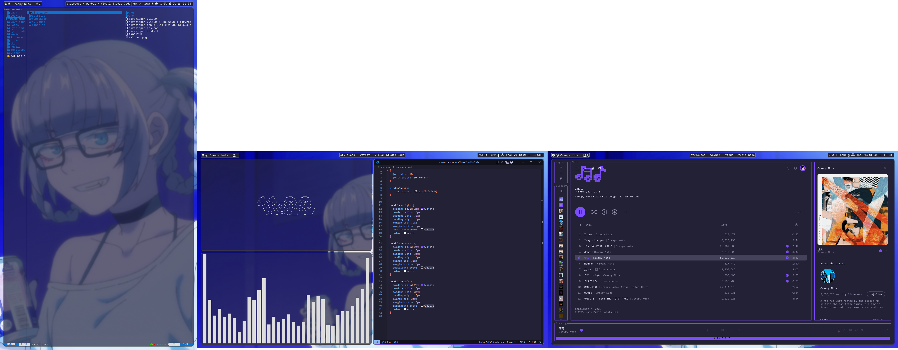
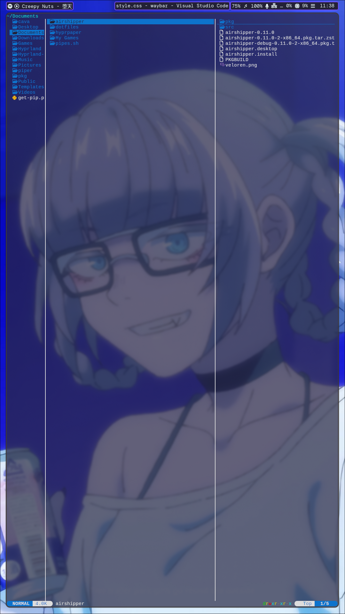
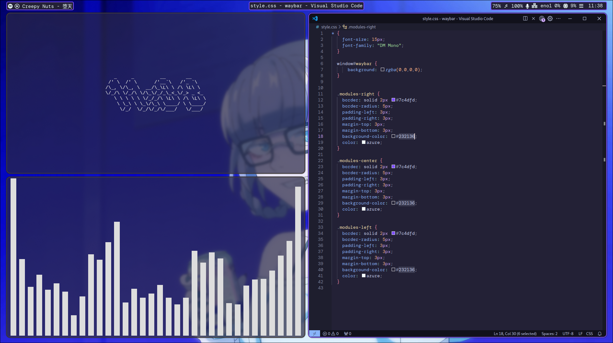
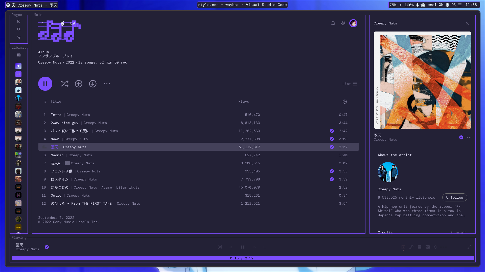

# .dotfiles
Various dotfiles for my Arch install

## Packages

- [Waybar](https://github.com/Alexays/Waybar)
- [Hyprland](https://hyprland.org/)
- [Hyprpaper](https://github.com/hyprwm/hyprpaper)
- [Kitty](https://sw.kovidgoyal.net/kitty/)
- [Wofi](https://archlinux.org/packages/extra/x86_64/wofi/)
- [Yazi](https://github.com/sxyazi/yazi)

### Console funzies

- [Cava](https://github.com/karlstav/cava)
- [Termdown](https://github.com/trehn/termdown)

## Info

This is my first time creating something like that and the dotfiles might not work on your install. Wallpaper and "Hyprpaper" paths need to be updated to your liking.

## Screenshots

